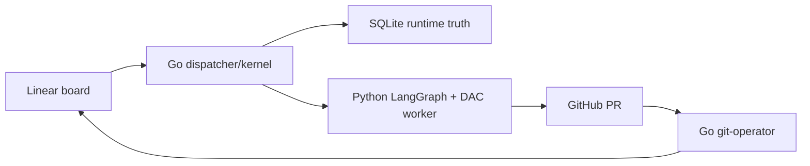

<!-- managed:readme-agents-doc:section=HERO:BEGIN -->
# clipse

Autonomous coding-agent orchestrator: Linear issues to merged PRs via typed worker lanes.
<!-- managed:readme-agents-doc:section=HERO:END -->

<!-- managed:readme-agents-doc:section=WHY:BEGIN -->
## Why

Most coding-agent loops mix scheduling, prompts, Git, Linear writes, and merge logic in one fragile path. Clipse splits the work: a deterministic Go kernel owns local state, claims, retries, board transitions, and merge gates, while Python LangGraph + Deep Agents Code workers handle the LLM turns inside isolated git worktrees. That split keeps the control plane testable without a model and lets each issue move from Linear intent to PR review and merge with bounded recovery rules.

**Use it when:** you want a personal Linear-to-PR automation loop for one repo; you need deterministic board state, typed worker results, and local auditability; you want separate coder, reviewer, and git-operator behavior.

**Don't use it for:** multi-tenant hosted agent infrastructure; repos where untrusted issue text must never reach a shell-capable coding worker; casual one-off code generation.
<!-- managed:readme-agents-doc:section=WHY:END -->

<!-- managed:readme-agents-doc:section=QUICKSTART:BEGIN -->
## Quickstart

```sh
make build
./bin/clipse --help
make test
```

Expected result: the binary prints the `dispatch`, `status`, and `tui` subcommands, then the Go race suite and Python tests pass.
<!-- managed:readme-agents-doc:section=QUICKSTART:END -->

<!-- managed:readme-agents-doc:section=FEATURES:BEGIN -->
## Features

- **Deterministic Go kernel** — claims work, records runs, mirrors Linear transitions through an outbox, and keeps the LLM out of control-plane decisions.
- **Typed worker contract** — JSON Schema generates both Go and Pydantic types, so worker results stay compatible across the process boundary.
- **Isolated worktrees** — each issue runs in its own git worktree with bounded runtime, retry, rework, and orphan-recovery behavior.
- **Real review and merge lanes** — coder and reviewer lanes run DAC turns; the git-operator merge gate is deterministic Go.
- **Live operations surface** — `clipse status` prints a SQLite snapshot, and `clipse tui` shows the board, activity, transcripts, and worker tails.
- **Behavioral evals** — `make eval` runs live-model cases that pin known coder, docs, and reviewer incidents.
<!-- managed:readme-agents-doc:section=FEATURES:END -->

<!-- managed:readme-agents-doc:section=USAGE:BEGIN -->
## Usage

### Configure a dispatcher

```sh
cp configs/clipse.example.yaml configs/clipse.yaml
$EDITOR configs/clipse.yaml
./bin/clipse dispatch --config configs/clipse.yaml
```

The dispatcher polls the configured Linear team, claims eligible issues into SQLite, spawns workers, and mirrors board transitions back through the outbox.

### Inspect board state

```sh
./bin/clipse status --board ./.clipse
./bin/clipse tui --board ./.clipse
```

`status` is a one-shot table. `tui` is the live terminal dashboard over the same kernel SQLite state.
<!-- managed:readme-agents-doc:section=USAGE:END -->

<!-- managed:readme-agents-doc:section=ARCHITECTURE:BEGIN -->
## Architecture

Clipse is a Go CLI and daemon with a Python worker package under `agent/`. The Go side owns config, Linear polling, SQLite state, board transitions, worker spawning, worktree lifecycle, and GitHub merge gates. The Python side owns the LangGraph/DAC coder, docs, and reviewer turns, then emits one schema-valid `WorkerResult` on stdout.



**Request path (one trace):** Linear issue with an `agent:<lane>` label -> dispatcher poll -> SQLite CAS claim -> worker subprocess in a git worktree -> typed JSON result -> store transition plus outbox row -> Linear state/comment update -> reviewer or git-operator lane -> merged PR -> `done`.

Full rationale and decision log: [docs/design/2026-07-01-clipse-design.md](docs/design/2026-07-01-clipse-design.md).
<!-- managed:readme-agents-doc:section=ARCHITECTURE:END -->

<!-- managed:readme-agents-doc:section=GOTCHAS:BEGIN -->
## Gotchas

- **SQLite is runtime truth** — Linear expresses task intent, but the dispatcher-owned SQLite state decides current board status and active claims; see [AGENTS.md](AGENTS.md).
- **`running` is CAS-only** — never write `board_status='running'` directly; only `store.ClaimReady` may enter that state.
- **Contracts are generated** — edit `schema/*.schema.json`, then run `make codegen`; do not hand-edit `internal/contract/contract.go` or `agent/src/clipse_agent/contract.py`.
- **Live evals cost tokens** — `make eval` uses real models and `gh`; it is outside `make test` and needs `ANTHROPIC_API_KEY` unless the selected lane model manages its own auth.
- **Codex OAuth is file-backed** — `openai_codex:*` lanes need a one-time `/auth` sign-in as the dispatcher OS user, and the resulting `~/.deepagents/.state/chatgpt-auth.json` is reachable through the inherited `HOME`.
- **Unrestricted shell is the default** — omitted `shell_allow_list` means `all`, so worker shell tools are auto-approved for that lane.
<!-- managed:readme-agents-doc:section=GOTCHAS:END -->

<!-- managed:readme-agents-doc:section=DEVELOPMENT:BEGIN -->
## Development

**Prerequisites:** Go 1.25, Python 3.13, `uv`, `gh` for live PR paths, and Linear/GitHub/model credentials only when running a dispatcher or live eval.

```sh
make build
make test
make lint
make codegen
```

Common tasks:

- `make build` — compile `./bin/clipse`.
- `make test` — run the Go race suite and `agent/` pytest.
- `make lint` — run `go vet`, `gofmt` check, and `ruff`.
- `make codegen` — regenerate Go and Python contract types from `schema/`.
- `make run` — run the CLI through `go run ./cmd/clipse`.
- `make eval` — run live-model behavioral evals.

For agent workflows, invariants, and PR conventions, see [AGENTS.md](AGENTS.md).
<!-- managed:readme-agents-doc:section=DEVELOPMENT:END -->

<!-- managed:readme-agents-doc:section=LICENSE:BEGIN -->
## License

No license file is present in this checkout.
<!-- managed:readme-agents-doc:section=LICENSE:END -->
