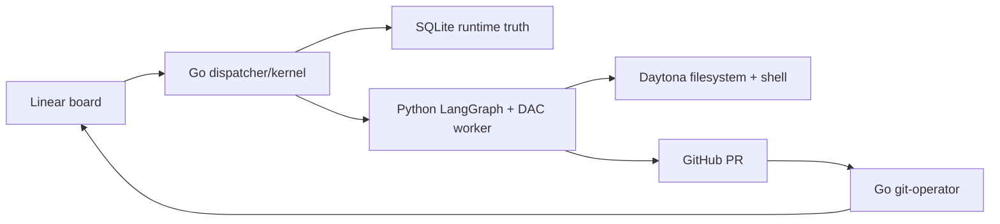

<!-- managed:readme-agents-doc:section=HERO:BEGIN -->
# clipse

Autonomous coding-agent orchestrator: Linear issues to merged PRs via typed worker lanes.
<!-- managed:readme-agents-doc:section=HERO:END -->

<!-- managed:readme-agents-doc:section=WHY:BEGIN -->
## Why

Most coding-agent loops tangle scheduling, prompts, Git, Linear writes, and merge logic into one fragile path. Clipse splits them: a deterministic, LLM-free Go kernel owns local state, claims, retries, board transitions, and merge gates, while Python LangGraph + Deep Agents Code workers run model turns. Daytona is the recommended agent backend; it isolates each worker's filesystem and shell tools while the controller and credentials stay on the host. Local git worktrees remain supported for compatibility.

**Use it when:** you want autonomous, unattended agent work — a queue of Linear issues turned into merged PRs while you sleep; you need a deterministic, auditable control plane where local SQLite is runtime truth and board transitions and merge gates stay LLM-free; you want distinct coder, reviewer, and git-operator lanes with isolated execution, bounded retry, rework, and recovery.

**Don't use it for:** a replacement for interactive assistants like Claude Code or Codex — clipse orchestrates unattended batch work, it isn't hands-on pair-programming; multi-tenant hosted agent infrastructure; repos where untrusted issue text must never reach a shell-capable worker (the default shell is unrestricted).
<!-- managed:readme-agents-doc:section=WHY:END -->

<!-- managed:readme-agents-doc:section=QUICKSTART:BEGIN -->
## Quickstart

```sh
make build
./bin/clipse --help
make test
```

Expected result: the binary prints the `board`, `dispatch`, `status`, and `tui` subcommands, then the Go race suite and Python tests pass.
<!-- managed:readme-agents-doc:section=QUICKSTART:END -->

<!-- managed:readme-agents-doc:section=FEATURES:BEGIN -->
## Features

- **Deterministic Go kernel** — claims work, records runs, mirrors Linear transitions through an outbox, and keeps the LLM out of control-plane decisions.
- **Typed worker contract** — JSON Schema generates both Go and Pydantic types, so worker results stay compatible across the process boundary.
- **Isolated agent tools** — Daytona runs DAC filesystem and shell tools in remote sandboxes; local worktrees remain an explicit option.
- **Real review and merge lanes** — coder and reviewer lanes run DAC turns; the git-operator merge gate is deterministic Go.
- **Declarative board bootstrap** — `clipse board plan|apply` reconciles a `board.yaml` of issues, dependencies, and lane labels onto Linear, and a re-apply touches only what changed.
- **Board-independent state labels** — optionally mirror Clipse columns through `clipse:<state>` labels instead of changing a team's Linear workflow.
- **Live operations surface** — `clipse status` prints a SQLite snapshot, and `clipse tui` shows the board, activity, transcripts, and worker tails.
- **Behavioral evals** — `make eval` runs live-model cases that pin known coder, docs, and reviewer incidents.
<!-- managed:readme-agents-doc:section=FEATURES:END -->

<!-- managed:readme-agents-doc:section=USAGE:BEGIN -->
## Usage

### Configure a dispatcher

Install and authenticate `gh`, then provide the Daytona key to the dispatcher:

```sh
gh auth login --hostname github.com
export DAYTONA_API_KEY="..."
```

```sh
cp configs/clipse.example.yaml configs/clipse.yaml
$EDITOR configs/clipse.yaml
./bin/clipse dispatch --config configs/clipse.yaml
```

The shipped example selects `agent_backend.type: daytona`. Its coder and docs turns reuse one issue-scoped sandbox; each reviewer run gets a fresh disposable sandbox. Sandboxes stop after 60 idle minutes by default. Reviewers also request automatic deletion after 60 minutes as a fallback to explicit cleanup. Daytona setup or provider failures stop the run—Clipse never falls back silently to local execution.

For the complete single-instance and multi-instance setup, including credentials, state modes, Daytona snapshots, isolated board directories, and verification, see the [configuration guide](docs/configuration-guide.md).

To keep the original host-worktree path, set `agent_backend.type: local` or omit the entire `agent_backend` block. Local mode is supported but is not recommended for new installations.

By default, Clipse maps its columns to Linear workflow states. To leave a shared team's workflow untouched, set `state_label_prefix: "clipse:"` and pre-create these team labels: `clipse:todo`, `clipse:ready`, `clipse:running`, `clipse:review`, `clipse:merging`, `clipse:done`, `clipse:rework`, and `clipse:blocked`. Startup verifies the complete set before claiming work. In label mode, an opted-in issue with no state label starts at `todo`; multiple or unknown `clipse:` state labels fail safe to `blocked`. Completed and canceled Linear workflow types remain terminal safety overrides. Reaching `done` removes the issue's `agent:<lane>` opt-in label. To requeue it safely, remove `clipse:done` (or replace it with `clipse:todo`), reopen a completed/canceled Linear workflow into any non-terminal state when needed, and only then add the desired `agent:<lane>` label as the final step. Terminal workflow types override state labels.

### Bootstrap a Linear board

A new project needs a board before the dispatcher has work: issues, `blocked-by` dependencies, and `agent:<lane>` labels. Describe it once in a `board.yaml` (shape: `configs/board.example.yaml`), preview the changes, then apply:

```sh
./bin/clipse board plan board.yaml
./bin/clipse board apply board.yaml
```

A second apply skips unchanged issues, updates edited ones, and never deletes — a hidden ref marker in each issue ties it to its spec entry. The repo-versioned `clipse-board-bootstrap` skill (`skills/`) turns a prose project plan into a valid `board.yaml`.

### Inspect board state

```sh
./bin/clipse status --board ./.clipse
./bin/clipse tui --board ./.clipse
```

`status` is a one-shot table. Its backend columns show the provider, role, lifecycle state, and shortened sandbox ID. `tui` shows the full sandbox ID, remote path, last lifecycle action, and sanitized cleanup error in issue details. Cleanup is durable: terminal coder sandboxes and every reviewer sandbox enter a retryable cleanup queue, and startup reconciliation repairs interrupted lifecycle work.
<!-- managed:readme-agents-doc:section=USAGE:END -->

<!-- managed:readme-agents-doc:section=ARCHITECTURE:BEGIN -->
## Architecture

Clipse is a Go CLI and daemon with a Python worker package under `agent/`. The Go side owns config, Linear polling, SQLite state, board transitions, backend lifecycle records, worker spawning, and GitHub merge gates. The Python host process owns LangGraph, model calls, and the typed Daytona lifecycle/session integration. Only DAC filesystem and shell tools run in Daytona. The worker emits one schema-valid `WorkerResult` on stdout.



**Request path (one trace):** Linear issue with an `agent:<lane>` label -> dispatcher poll -> SQLite CAS claim -> worker subprocess using the configured agent backend -> typed JSON result -> store transition plus outbox row -> Linear workflow-state or `clipse:<state>` label update plus comment -> reviewer or git-operator lane -> merged PR -> `done`.

Full rationale and decision log: [docs/design/2026-07-01-clipse-design.md](docs/design/2026-07-01-clipse-design.md).
<!-- managed:readme-agents-doc:section=ARCHITECTURE:END -->

<!-- managed:readme-agents-doc:section=GOTCHAS:BEGIN -->
## Gotchas

- **SQLite is runtime truth** — Linear expresses task intent, but the dispatcher-owned SQLite state decides current board status and active claims; see [AGENTS.md](AGENTS.md).
- **State labels are opt-in and pre-existing** — `state_label_prefix` switches all non-terminal state reads and writes to the eight reserved labels; Clipse validates them at startup but does not create them.
- **`running` is CAS-only** — never write `board_status='running'` directly; only `store.ClaimReady` may enter that state.
- **Contracts are generated** — edit `schema/*.schema.json`, then run `make codegen`; do not hand-edit `internal/contract/contract.go` or `agent/src/clipse_agent/contract.py`.
- **Live evals cost tokens** — `make eval` uses real models and `gh`; it is outside `make test` and needs `ANTHROPIC_API_KEY` unless the selected lane model manages its own auth.
- **Daytona does not receive GitHub credentials** — trusted host code reads `gh auth token` only when a Daytona SDK Git call needs it; the token is not put in the sandbox environment, Git config, prompt, transcript, or result.
- **There is no Daytona-to-local fallback** — a missing key, failed `gh` preflight, or provider outage blocks/retries through the typed lifecycle path instead of running issue-driven tools on the host.
- **Codex OAuth is file-backed** — `openai_codex:*` lanes need a one-time `/auth` sign-in as the dispatcher OS user. In Daytona mode, DAC shell tools cannot read the host token file.
- **Unrestricted shell is the default** — omitted `shell_allow_list` means `all`, so worker shell tools are auto-approved for that lane.
<!-- managed:readme-agents-doc:section=GOTCHAS:END -->

<!-- managed:readme-agents-doc:section=DEVELOPMENT:BEGIN -->
## Development

**Prerequisites:** Go 1.25, Python 3.13, `uv`, `gh` for live PR paths, and Linear/GitHub/model credentials only when running a dispatcher or live eval.

```sh
make build
make test
make lint
make codegen
```

Common tasks:

- `make build` — compile `./bin/clipse`.
- `make test` — run the Go race suite and `agent/` pytest.
- `make lint` — run `go vet`, `gofmt` check, and `ruff`.
- `make codegen` — regenerate Go and Python contract types from `schema/`.
- `make run` — run the CLI through `go run ./cmd/clipse`.
- `make eval` — run live-model behavioral evals.
- `make smoke-daytona-backend` — run the opt-in real coder/reviewer Daytona smoke. It opens a draft PR, never merges it, and deletes the PR branch and both sandboxes.

The Daytona smoke needs `DAYTONA_API_KEY`, host `gh` authentication, and the selected model credential. To load a repo-local environment file without copying it into a worktree, run:

```sh
uv run --env-file .env --project agent python scripts/smoke_daytona_backend.py
```

For agent workflows, invariants, and PR conventions, see [AGENTS.md](AGENTS.md).
<!-- managed:readme-agents-doc:section=DEVELOPMENT:END -->

<!-- managed:readme-agents-doc:section=LICENSE:BEGIN -->
## License

No license file is present in this checkout.
<!-- managed:readme-agents-doc:section=LICENSE:END -->
