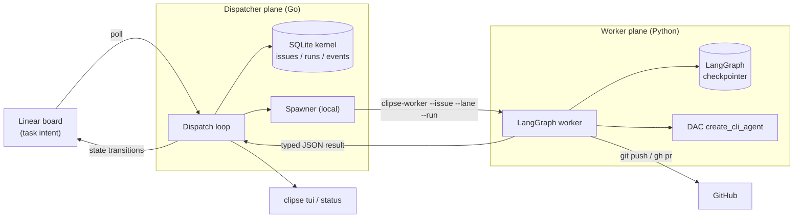
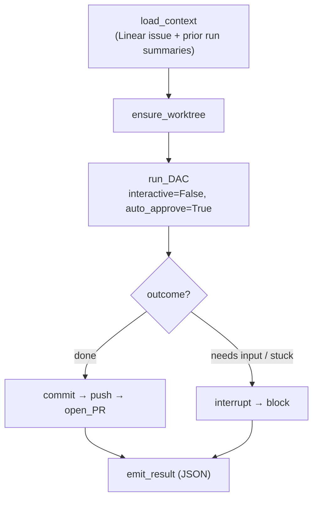

# Clipse — Technical Design

**Status:** Draft for review · **Date:** 2026-07-01 · **Owner:** Kyle

## Overview

Clipse is a personal, autonomous coding-agent orchestrator. A deterministic
dispatcher watches a Linear board and, for each eligible issue, spins up a
headless coding-agent worker in an isolated git worktree. The worker writes
code, commits, and opens a PR; downstream lanes review, merge, and document it.
Work fans out across many issues in parallel.

One line: **Symphony's Linear-as-control-plane + Hermes's dispatcher discipline,
with per-lane LangGraph workers wrapping Deep Agents Code (DAC) as the engine.**

### Goals

- Turn Linear issues into merged PRs with no human in the inner loop.
- Run many workers concurrently (fan-out), safely.
- Survive crashes and restarts without losing or double-running work.
- Keep the scheduler deterministic and testable; keep the LLM off the critical
  state machine.

### Non-goals (v1)

- Automatic task decomposition / an orchestrator agent (v2).
- Multi-repo (v2 — config is shaped for it).
- Remote/multi-host workers (v2 — behind a Spawner seam).
- A web dashboard (a terminal TUI covers v1).

### Inspirations

- **OpenAI Symphony** — the outer shape: Linear is the durable control plane, a
  reconciliation loop reads the board and spawns one workspace per issue, the
  orchestrator owns scheduling but not the work.
- **Hermes Kanban (NousResearch)** — the dispatcher discipline: atomic claim,
  leases, heartbeats, dependency promotion, stale/crash recovery, concurrency
  caps, a SQLite coordination kernel.
- **Deep Agents Code (DAC / LangChain `deepagents_code`)** — the coding engine.
  `create_cli_agent(assistant_id=…, interactive=False, auto_approve=False, interrupt_shell_only=True, shell_allow_list=[…], checkpointer=…)` (see the DAC spike findings under "Open questions / to verify" — `auto_approve` must stay `False` or the allow-list is silently dropped). Wrapped in a
  LangGraph graph for fine-grained control (checkpointed resume, interrupts,
  typed state).

## Architecture

Two planes, split by concern and language.

| Plane | Language | Owns |
|---|---|---|
| **Dispatcher / kernel** | Go | Poll, claim, spawn, monitor, **all board transitions**, concurrency caps, crash/stale recovery, TUI. Runtime truth in SQLite. |
| **Worker** | Python (LangGraph + DAC) | The per-issue pipeline as a graph. Emits a typed JSON result. Graph state in a LangGraph checkpointer. |

The boundary between them is a **subprocess + typed JSON result contract**.
The dispatcher spawns a worker per claimed issue and reads its result from
stdout. Neither plane shares memory or a database with the other.

Two stores, distinct concerns:

- **Kernel SQLite** (Go) — scheduling truth: issues cache, leases, run rows,
  PIDs, heartbeats, attempts, board mirror.
- **LangGraph checkpointer** (Python) — worker-internal graph state, used to
  resume a run across continuation turns.



## Board & state machine

Linear holds task **intent**; the dispatcher owns every **transition** off the
worker's typed result. The LLM never moves a card.

**Divergence rule:** the dispatcher is the only **automated** writer of board
state; a human may still move a card in Linear directly. On each poll, if
Linear disagrees with SQLite: when the issue holds no active claim, adopt
Linear's state (it's a human move); when the issue holds an active claim,
SQLite wins and the outbox re-asserts it to Linear (it's drift, not intent).
This is also how Linear-write failures self-heal (A2): the transition commits
to SQLite first, and a pending-write outbox drains and retries the mirror each
tick, so SQLite and Linear reconverge without a human in the loop.

Columns: `Todo → Ready → Running → Review → Merging → Documentation → Done`,
plus `Rework` and `Blocked`.

| Column | Meaning | Lane | Transition out |
|---|---|---|---|
| **Todo** | Has unfinished dependencies; not dispatchable | — | deps terminal → `Ready` |
| **Ready** | Dependencies clear; dispatcher may claim | Coder | claim → `Running` |
| **Running** | Claimed; worker active | (active lane) | per typed result |
| **Review** | PR open, awaiting review | Reviewer | pass → `Merging`; changes → `Rework` |
| **Rework** | Reviewer requested changes | Coder | re-run → `Review` |
| **Merging** | Approved; land it | Git-operator | merged + tagged → `Documentation` |
| **Documentation** | Merged; write docs (always-on) | Scribe | docs PR or no-op → `Done` |
| **Blocked** | Failed / stuck / needs input | — | human requeue → `Ready`/`Todo` |
| **Done** | Terminal | — | — |

### Lanes

A lane is a **named DAC profile** — its own system prompt, toolset, skills,
optional model override, and shell allow-list — selected per issue by a Linear
label `agent:<lane>`. New lanes are config, not code.

| Lane | Responsibility |
|---|---|
| **Coder** | Edit files, **commit, push, open the PR** on the issue's worktree/branch. |
| **Reviewer** | Check out the PR, review; return `pass` or `changes_requested` + inline comments. |
| **Git-operator** | **Merge** PRs (CI + branch-protection gated), tags, and repo-level git ops (cleanup, rebase-onto-main) outside coder scope. |
| **Scribe** | Documentation. Runs on every merged issue; no-ops when there is nothing to write. |

Merge is **auto-merge when clean** (D2): a reviewer pass hands off to the
Git-operator, which merges only when required CI checks are green and branch
protection is satisfied. No human merge gate.

**The authoritative merge gate is CI + branch protection, not the Reviewer.**
Coder and Reviewer share a model family, so a reviewer approving its sibling's
code is advisory signal, not a safety guarantee — auto-merge must never hinge on
LLM opinion alone. Branch protection (required status checks, up-to-date branch)
is what actually permits the merge. Optionally run the Reviewer lane on a
stronger or distinct model to reduce correlated blind spots.

## Components

### Dispatcher / kernel (Go)

Go version per `go.mod` — currently a 1.25 floor, forced by `modernc.org/sqlite`.
`go.mod` is the single source of truth; don't restate a version here or in the
plan.

A single long-running daemon (`clipse dispatch`). Holds a machine-global
singleton lock so only one dispatcher runs. Heavy logic lives in `internal/`
packages (unit-testable); the daemon is a thin composition root.

Responsibilities: poll Linear, normalize issues, run the state machine,
atomically claim ready work, enforce caps, spawn and monitor workers, recover
stale/crashed runs, and mirror transitions back to Linear.

### Worker (Python, LangGraph + DAC)

A per-issue subprocess (`clipse-worker --issue <id> --lane <lane> --run <run_id>
[--thread <thread_id>]`). Each lane is a small LangGraph graph built around a DAC
agent. The graph:

- gives **fine-grained control** the DAC CLI can't: typed graph state,
  checkpointed **resume** (for continuation turns), and **interrupts** (for
  blocked/needs-input);
- runs in the worktree the kernel resolved;
- writes its outcome as the graph's terminal state, serialized to JSON on
  stdout.

Coder graph (representative):



Reviewer, Git-operator, and Scribe are analogous graphs with lane-specific
nodes and DAC profiles.

### CLI + TUI (Go)

One binary, `clipse`, with subcommands:

- `clipse dispatch` — run the daemon + loop.
- `clipse status` — one-shot snapshot from the kernel SQLite.
- `clipse tui` — Symphony-style live dashboard (running / retrying / blocked
  tables, token + runtime counters, in-place refresh), reading the kernel
  SQLite. Linear stays the primary human board.
- `clipse board` — inspect/manage board state.

## Data model (kernel SQLite, WAL)

- **issues** — cache of Linear plus claim state: `identifier`, `lane_label`,
  `board_status`, `deps`, `priority`, `claim_lock`, `claim_expires`,
  `updated_at`, `last_seen`.
- **runs** — one row per attempt/turn: `run_id`, `issue_id`, `lane`,
  `worker_pid`, `status`, `started_at`, `heartbeat_at`, `attempt`, `turn_count`,
  `thread_id` (LangGraph), `result_json`, `error`, `tokens`.
- **events** — append-only audit stream; feeds the TUI.

Claiming is a compare-and-swap: `UPDATE ... SET claim_lock=? WHERE
board_status='ready' AND claim_lock IS NULL`.

### Typed result contract

`schema/worker-result.schema.json` is the source of truth; `make codegen`
generates Go structs (`internal/contract`) and Pydantic models
(`clipse_agent.contract`). Shape (indicative):

```jsonc
{
  "run_id": "…", "issue_id": "…", "lane": "coder",
  "outcome": "done | needs_review | changes_requested | blocked | continue",
  "block_kind": "needs_input | capability | transient",
  "summary": "…", "artifacts": ["…"], "pr_url": "…",
  "thread_id": "…", "turn_count": 3, "tokens": { "in": 0, "out": 0 }
}
```

`block_kind` is an optional string enum, never a `null` enum member: it is
**present iff `outcome == "blocked"`**, and absent otherwise. Both Go and
Pydantic sides test this invariant on round-trip.

`schema/board.schema.json` defines the lane / column / block-kind enums shared
by both planes.

## Dispatch loop (tick order)

Adapted from Hermes `dispatch_once`, run each tick on interval (G — poll):

1. Hold the singleton dispatcher lock.
2. Poll Linear for active-state issues; normalize; upsert `issues`.
3. **Reconcile running**: reap dead PIDs, reclaim on stale heartbeat / expired
   claim, kill workers over `max_runtime`.
4. **Promote** `Todo → Ready` when all Linear blockers are terminal.
5. **Select** `Ready` ordered by (priority, created_at, identifier); apply
   global cap and per-lane caps.
6. **Claim** (CAS), write a `runs` row, mirror Linear → `Running`.
7. **Spawn** the worker in its worktree via the Spawner; record `worker_pid`.
8. **On exit**: parse the typed result → map to a transition
   (`done`/`needs_review`/`changes_requested`/`blocked`); `continue` re-spawns a
   turn if under the per-issue **turn cap**. Close the run; append events.
9. Snapshot → TUI.

## Concurrency & fan-out

- **Global cap** (`max_in_progress`) and **per-lane caps** (e.g. coder=4,
  reviewer=2, git-operator=1, scribe=1).
- Workers run as local subprocesses in v1, spawned through a **`Spawner`
  interface**. A remote/SSH implementation can drop in later without touching
  the loop.

## Workspace & git lifecycle

- One **git worktree per issue**, off a primary clone of the single configured
  repo. Branch name comes from Linear (so the PR auto-links to the issue). Base
  branch is configured.
- Continuation turns **reuse** the same worktree; on-disk progress carries
  across turns even though a fresh agent turn starts.
- Cleanup on terminal states (`Done`/`Cancelled`): remove the worktree and local
  branch after merge.
- **Coder** commits/pushes/opens the PR. **Git-operator** merges (gated) and
  tags. Merge safety is delegated to GitHub branch protection + required checks.
- **PR creation is idempotent.** The branch name is deterministic (issue →
  branch), so a crash after `push` but before the dispatcher records the PR — or
  an auto-continuation turn — must not open a second PR. `open_PR` first checks
  whether a PR already exists for the branch (`gh pr view`) and reuses it;
  further work is appended to the existing branch, not duplicated.

## Failure handling & resilience

Derived from Hermes:

- WAL + `BEGIN IMMEDIATE` + CAS claim → no double-claims.
- Machine-global singleton dispatcher lock.
- Claim TTL + heartbeat → no indefinite `Running`.
- PID crash detection requeues/fails dead workers.
- `max_runtime` kills and requeues over-budget workers.
- **Everything parks in `Blocked`** on failure (H): no failure auto-retry
  classification. A stuck/failed/needs-input run moves to `Blocked` with a
  reason comment; you requeue. The per-issue turn cap bounds continuation, so
  clean-but-incomplete runs can't churn forever.
- **Dispatcher-restart orphans are requeued, not Blocked.** H governs *worker*
  failures (stuck/failed/needs-input); a dispatcher restart is infrastructure,
  not a worker failure. On startup, before any claim release, the dispatcher
  kills every process recorded in an open `runs` row (verifying process
  identity via a recorded start time / pgid, since a bare PID can name an
  unrelated process after reboot), closes those runs, and requeues their
  issues to `ready` with an incremented `attempt` — bounded by `max_attempts`
  (exceeding it lands `Blocked`). This runs strictly before `ReleaseStaleClaims`
  so a live orphan can never keep pushing after its issue is requeued (the
  double-run the CAS claim exists to prevent).

## Threat model

Linear issue content is **untrusted input** to a shell-enabled agent running
`auto_approve=True`. A crafted issue body can steer a worker into any command
its lane allow-lists.

- **Mitigations**: per-lane shell allow-lists (a lane can only run the
  commands its job requires — enforced only when the worker sets
  `auto_approve=False, interrupt_shell_only=True`, per the DAC spike findings;
  `auto_approve=True` silently drops the allow-list); the worker env carries only the secrets that
  lane needs (`ANTHROPIC_API_KEY`, a scoped `gh` token) — never
  `LINEAR_API_KEY`, which is kernel-only and never passed to a worker; merge is
  gated by CI + branch protection, so injected code cannot land without
  passing required checks; the board is private and single-tenant.
- **Non-goals (v1)**: full sandboxing (containers/VMs). Revisit in Phase 4 if
  the board ever accepts external (non-owner) input.
- **Accepted residual risk**: for a personal tool on a private, single-tenant
  board, the above mitigations are judged sufficient; this is a stated
  trade-off, not an oversight.

## Observability

- `clipse tui` / `clipse status` over the kernel SQLite snapshot.
- Structured JSON logs (OTel-friendly; can ship to Datadog later).
- Per-issue worker logs on disk, path recorded in `runs`.
- Linear board is the primary human view.

## Config & secrets

- `configs/clipse.example.yaml`: repo (remote/path/base branch), poll interval,
  global + per-lane caps, turn cap, `max_runtime`, lane→label map.
- Secrets via `op run` / env (per global setup):
  - v1 kernel: `LINEAR_API_KEY`.
  - Phase 2+ worker: `ANTHROPIC_API_KEY`, `gh` auth for PRs/merges.

## Repository layout

Monorepo, folder-per-service, single Go module + one Python package.

```
clipse/
├── README.md
├── Makefile                      # build / test / codegen across Go + Python
├── go.mod                        # single module: github.com/xlyk/clipse
├── docs/design/2026-07-01-clipse-design.md
├── .github/workflows/ci.yml
│
├── schema/                       # ★ shared contract (source of truth)
│   ├── worker-result.schema.json
│   └── board.schema.json
│
├── cmd/clipse/main.go            # thin entrypoint → cobra root (single binary)
│
├── dispatcher/                   # package: daemon + dispatch loop (`clipse dispatch`)
├── cli/                          # package: cobra subcommands (status / board / tui)
│   └── tui/                       #   bubbletea dashboard (reads kernel SQLite)
│
├── internal/                     # shared Go logic (heavy code, unit-tested)
│   ├── linear/                    #   GraphQL client + issue normalize
│   ├── store/                     #   SQLite kernel: issues/runs/events, WAL, migrations
│   ├── board/                     #   state machine + transitions
│   ├── spawn/                     #   Spawner iface + local impl
│   ├── gitops/                    #   merge/tag/cleanup as deterministic Go (Git-operator lane executor)
│   ├── contract/                  #   Go structs generated from schema/
│   └── config/
│
├── agent/                        # Python service → entrypoint `clipse-worker`
│   ├── pyproject.toml             #   uv
│   ├── src/clipse_agent/
│   │   ├── worker.py              #   args in → typed JSON out
│   │   ├── dac.py                 #   create_cli_agent wiring
│   │   ├── contract.py            #   Pydantic models (from schema/)
│   │   ├── profiles/              #   per-lane DAC config (prompt/tools/skills/model)
│   │   └── graphs/{coder,reviewer,scribe}.py   # git_operator runs as internal/gitops, not a graph
│   └── tests/
│
├── testworker/                   # Go fake worker for v1 kernel tests (canned JSON)
│   └── main.go
│
└── configs/clipse.example.yaml
```

Notes:

- **Single Go module**; `dispatcher/`, `cli/`, `internal/` are packages; the one
  `clipse` binary wires subcommands in `cmd/clipse`.
- **`schema/` → codegen both sides** via `make codegen` (go-jsonschema +
  datamodel-code-generator).
- The C1 subprocess+JSON contract makes `testworker/` trivial: a stub that emits
  a canned typed result (including failure/crash/continue scenarios) so the
  kernel is fully testable without an LLM.

## Build phases

1. **v1 — Go kernel + TUI, fake worker.** SQLite schema + migrations, Linear
   poll/normalize, state machine, CAS claim, caps, stale/crash reclaim,
   transitions, Spawner interface, `clipse status`/`tui`. Built test-first
   against `testworker/`. Zero LLM tokens.
2. **Coder LangGraph worker** (real DAC) behind the contract → real PRs.
3. **Reviewer + Git-operator + Scribe** lanes; auto-merge; Merging / Rework /
   Documentation columns live.
4. **v2**: orchestrator / auto-decompose, multi-repo, remote Spawner, richer
   observability.

## Open questions / to verify

- **DAC ↔ LangGraph resume specifics** — ✅ **RESOLVED by the spike (2026-07-01,
  `deepagents_code` 0.1.22)**; see "DAC API spike findings" below.
- **Linear workflow-state setup** — create the custom columns (`Rework`,
  `Merging`, `Documentation`) and the `agent:<lane>` labels; confirm the
  candidate-issue GraphQL query and branch-name auto-link behavior.
- **Git-operator merge gating** — confirm branch-protection + required-check
  configuration on the target repo so auto-merge is safe.
- **Continuation vs Blocked boundary** — final turn-cap value and what a worker
  returns as `continue` vs `blocked`.

### DAC API spike findings (verified 2026-07-01, `deepagents_code` 0.1.22)

Source-verified against the installed package (`file:line` cites are in
`deepagents_code`), not docs. Net: wrap DAC as an **in-process LangGraph graph**;
do **not** shell out to `dcode -n`.

1. **Headless invocation** — `from deepagents_code.agent import create_cli_agent`
   returns `(Pregel, CompositeBackend)`: an already-compiled LangGraph the worker
   `.ainvoke`/`.astream`s in-process (DAC's own ACP mode does exactly this at
   `main.py:1889`). `assistant_id: str` is a **required positional** (the earlier
   design snippet omitted it). Kwargs `interactive`, `auto_approve`, `enable_shell`,
   `shell_allow_list`, `model`, `checkpointer` all exist.
2. **Shell safety — design change.** `auto_approve=True` silently disables the
   allow-list: `restrictive_shell_allow_list` is set only under
   `if interrupt_shell_only and not auto_approve` (`agent.py:1336`),
   `ShellAllowListMiddleware` is installed only when that list is non-nil
   (`agent.py:1597`), and `auto_approve` forces `interrupt_on={}` (`agent.py:1612`).
   So the original `create_cli_agent(auto_approve=True, shell_allow_list=[…])`
   would run with **no shell enforcement** on an unsandboxed `LocalShellBackend`.
   The worker **must** use `auto_approve=False, interrupt_shell_only=True,
   shell_allow_list=[…]` — that path installs the middleware, which rejects
   disallowed commands inline as error `ToolMessage`s (no HITL stall). This
   supersedes every doc mention of `auto_approve=True`.
3. **Resume** — DAC uses upstream LangGraph `AsyncSqliteSaver` (`sessions.py:1239`);
   `create_cli_agent(checkpointer=…)` is caller-supplied (`agent.py:1196`), so the
   kernel owns the checkpoint-db path and passes `thread_id` via
   `config={"configurable": {"thread_id": …}}`. But the bundled headless runner
   `run_non_interactive` has **no `thread_id`/resume parameter** (verified
   signature) — it always starts a fresh thread. Non-interactive resume works
   **only** through the direct in-process graph call, never DAC's own CLI.
4. **Result / stop-reason / tokens** — DAC exposes **no** `stop_reason` /
   `finish_reason`. Completion-vs-interrupt is inferred from a `"__interrupt__"`
   key in an `updates`-mode stream chunk; token usage is per-`AIMessage`
   `usage_metadata` (`non_interactive.py:377`) the worker must aggregate itself
   (DAC's `SessionStats` is CLI-internal). A turn-cap overrun raises
   `HITLIterationLimitError` (exit 124), not a structured field. Interrupts are
   one generic HITL shape — the worker classifies `needs_input` vs `blocked`.
5. **API stability** — every symbol the worker imports is internal (no `__all__`,
   not re-exported from `__init__.py`), pre-1.0; `deepagents_code` itself pins
   `deepagents==0.6.11` exactly. **Pin `deepagents-code==0.1.22`** in
   `agent/pyproject.toml` so a routine upgrade can't silently rename these imports.

## Decision log

| # | Decision |
|---|---|
| A | Single dispatcher + local SQLite runtime store; Linear = task intent |
| B | Dispatcher owns all board transitions (off typed worker results) |
| C1 | Subprocess per issue (`clipse-worker`; PID/run-id in SQLite) |
| C2 | Symphony-style auto-continuation + hard per-issue turn cap; resume via LangGraph checkpointer |
| D1 | Lane = named DAC profile, `agent:<lane>` label-selected |
| D2 | Reviewer reviews → auto-merge when clean; else Rework → Coder |
| D3 | Always-on Documentation stage (Scribe no-ops if nothing) |
| E | Single machine + pluggable Spawner seam + global/per-lane caps |
| F | Single configured repo; worktree-per-issue |
| G | Poll Linear on interval |
| H | Everything parks in Blocked (no failure auto-retry) |
| I | Dependencies only for v1 (orchestrator/decompose = v2) |
| J | 4 lanes: Coder (edit+commit+push+PR), Reviewer, Git-operator (merge+tags), Scribe; merge gated by branch protection + CI. **Amended:** the Git-operator lane's *executor* is deterministic kernel code (`internal/gitops`), not a DAC worker — merge/tag/cleanup is pure CLI/API work with exact success criteria, and running it through an LLM adds cost, latency, and nondeterminism at the single most dangerous transition in the pipeline. The `git_operator` lane label remains board semantics only. |
| K | Linear board + Symphony-style terminal TUI |
| L | Go dispatcher/CLI/TUI + Python LangGraph worker |
| M | v1 = kernel-first, tested against a fake worker |
| N | Secrets via `op`/env (`LINEAR_API_KEY` v1; `ANTHROPIC_API_KEY` + `gh` phase 2) |
| O | Dispatcher-restart orphans are requeued to `ready` with an incremented `attempt` (bounded by `max_attempts`), not parked in `Blocked` by default — refines H, which governs worker failures; a dispatcher restart is infrastructure |
| P | **Cross-lane claiming = per-column claim, not handoff-spawn** (Phase 3): a downstream card is claimed *in place* in its entry column via `store.ClaimColumn` (CAS-lock, `board_status` unchanged), so the claim — not a fire-after-transition spawn — is the restart-safe source of truth (a crash after the transition still leaves a claimable card). `review`→reviewer, `rework`→coder, `documentation`→scribe run as DAC workers; `merging` runs `internal/gitops` inline. Stale-release/orphan-recover return a card to `ready` only when it was `running` (coder), else keep its own column (shared `ColumnAfterRelease` helper). Downstream claims don't mirror Linear (the column didn't change). |
| Repo | Single Go module; one `clipse` binary (subcommands); JSON Schema → codegen both sides |
