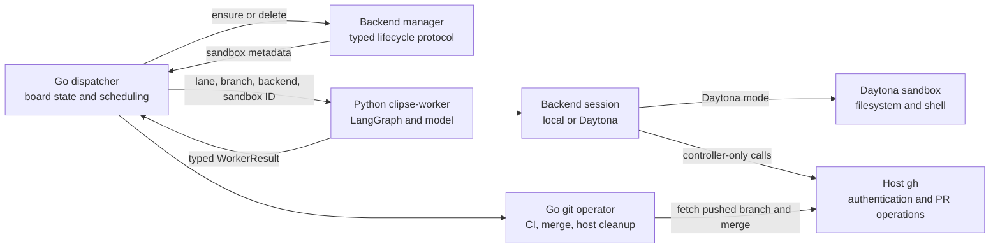
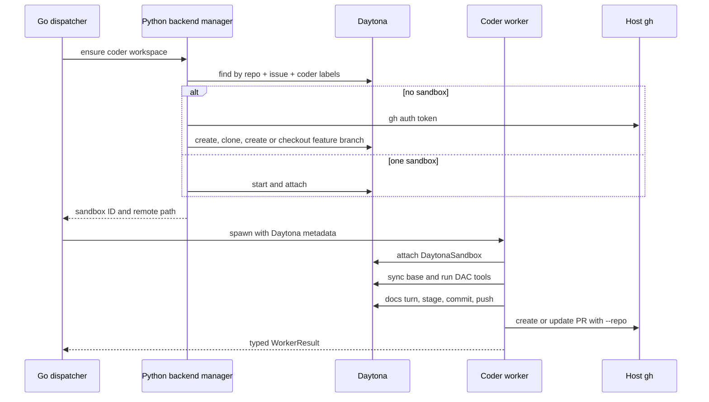

# Daytona Agent Backend Design

**Date:** 2026-07-11  
**Status:** Approved for implementation  
**Supersedes:** The production exclusions in `2026-07-11-daytona-agent-backend-poc-design.md`; the POC remains a diagnostic tool.

## Summary

Clipse will run each DAC agent's filesystem and shell tools in a Daytona sandbox while keeping the Go dispatcher, Python LangGraph controller, model calls, credentials, and deterministic Git operator on the host. Daytona becomes the recommended backend for new installations. The current local-worktree backend remains available and remains the compatibility default when `agent_backend` is absent.

Coder and documentation turns for one issue share a persistent Daytona sandbox. Each reviewer attempt receives a fresh disposable sandbox cloned from the pushed pull-request branch. This split preserves coder state across rework while preventing the reviewer from inheriting or mutating the coder's environment.

The host obtains GitHub credentials through `gh`. Trusted controller code passes the token directly to Daytona SDK Git methods and host `gh --repo` commands. DAC never receives the token, and the sandbox never stores it.

## Goals

1. Route every DAC filesystem and shell operation through Daytona when configured.
2. Keep LangGraph, the LLM, Clipse's board state, and the deterministic Git operator on the host.
3. Preserve one coder workspace across coder, coder-docs, reviewer-requested rework, worker restart, and dispatcher restart.
4. Give every reviewer attempt a clean workspace containing exactly the pushed PR branch.
5. Use host `gh` authentication without exposing GitHub credentials to the sandbox or model.
6. Retain the local backend as an explicit, supported option.
7. Make create, attach, cleanup, and reconciliation state visible in SQLite, `clipse status`, the TUI, events, and logs.
8. Recover safely from worker crashes, dispatcher restarts, missing sandboxes, provider outages, and failed cleanup.

## Non-goals

- Running LangGraph or model-provider clients inside Daytona.
- Moving the deterministic Git-operator lane into Python or Daytona.
- Generalizing Clipse into a multi-provider sandbox platform beyond the interface required by local and Daytona backends.
- Persisting GitHub credentials in Daytona secrets, environment variables, files, Git configuration, or credential helpers.
- Silently falling back from Daytona to local execution.
- Adding a Daytona Go SDK.
- Merging a live-smoke-test pull request into `main`.

## Decisions

### Host controller, remote agent tools

The host owns orchestration. `clipse-worker` still builds and invokes the Coder or Reviewer LangGraph graph in its own host process. Model-provider credentials and checkpointer databases remain on the host. In Daytona mode, the worker creates a `DaytonaSandbox` wrapper and passes it to DAC's `create_cli_agent`; DAC's built-in file and shell tools then operate in the remote repository.

This boundary matches the successful POC. It avoids installing the model stack in every sandbox and keeps the kernel's control plane separate from untrusted issue-driven tool execution.

### Hybrid sandbox lifecycle

The sandbox role determines its lifecycle:

| Role | Identity | Contents | Lifetime |
| --- | --- | --- | --- |
| `coder` | Repository + issue ID | Feature branch and all coder/docs/rework state | Reattach until `done` or `cancelled` |
| `reviewer` | Repository + review run ID | Fresh clone of the pushed PR branch | One review attempt |

`coder_docs` runs inside the coder sandbox because it inspects and may document the coder's uncommitted edits before the controller commits them. The reviewer receives a fresh sandbox because Clipse's reviewer has writable DAC file tools and defaults to unrestricted shell. A prompt that says “read only” is not an isolation boundary.

The branch and pull request form the handoff between coder and reviewer. The reviewer therefore sees what GitHub and CI see, not untracked files, an index, or processes left by the coder.

### Python owns Daytona SDK integration

The production Python dependency changes from `deepagents-code==0.1.22` to `deepagents-code[daytona]==0.1.22`. This installs the Daytona SDK and `langchain-daytona` beside DAC. Clipse adds no Daytona Go dependency.

The Go kernel talks to a small typed lifecycle protocol implemented by `clipse-worker` in backend-action mode. The same configured `worker.command` can run either an agent turn or a lifecycle action, which avoids a second machine-specific command in `clipse.yaml`.

## Architecture



### Go responsibilities

The Go side:

- parses and validates backend configuration;
- chooses the local or Daytona provisioning path;
- invokes backend lifecycle actions before and after worker runs;
- records generic workspace metadata and cleanup state in SQLite;
- passes the selected provider, sandbox ID, remote path, repository, and branch through `WorkerSpec`;
- schedules durable cleanup and startup reconciliation;
- exposes lifecycle state through status, TUI, events, and structured logs;
- creates a host worktree for the Git operator only when a Daytona-authored branch reaches `merging`.

The kernel never imports a Daytona client, validates Daytona-specific API vocabulary, or handles a model object.

### Python responsibilities

The Python side adds:

- a backend-action protocol for `ensure`, `delete`, and `list`;
- `LocalSession` and `DaytonaSession` implementations;
- Daytona label construction and lookup;
- sandbox create, start, attach, stop, and delete calls;
- controller-owned clone, pull, stage, commit, and push operations;
- a DAC factory path that supplies `DaytonaSandbox` and the remote working directory;
- host `gh --repo` operations for pull requests, diffs, and review comments;
- sanitized, typed lifecycle errors.

The graph remains responsible for workflow order. The session decides where each workspace operation executes.

## Configuration

The optional top-level block is:

```yaml
agent_backend:
  type: daytona
  daytona:
    auto_stop_minutes: 60
    reviewer_auto_delete_minutes: 60
    # snapshot: clipse-agent
    # target: us
```

Rules:

- An absent `agent_backend` block resolves to `local` for compatibility.
- `type` accepts only `local` or `daytona`.
- The shipped example explicitly selects `daytona` and describes it as recommended.
- `auto_stop_minutes` defaults to `60` and must be positive.
- `reviewer_auto_delete_minutes` defaults to `60` and must be positive.
- `snapshot` and `target` are optional non-empty strings when present.
- Daytona mode requires `DAYTONA_API_KEY` in the dispatcher's environment.
- `DAYTONA_API_URL` and `DAYTONA_TARGET` remain optional standard SDK environment overrides; an explicit configured `target` wins over `DAYTONA_TARGET`.
- Daytona startup checks `gh auth status --hostname github.com` before the dispatcher claims work.
- A configured Daytona backend never falls back to local if preflight or a later provider call fails.

The dispatcher forwards `DAYTONA_API_KEY`, optional Daytona SDK variables, `HOME`, and `PATH` only to Daytona controller processes. Local workers do not inherit Daytona credentials. Existing model-credential forwarding remains unchanged.

## Backend lifecycle protocol

`clipse-worker` keeps its current one-line `WorkerResult` mode. A mutually exclusive `--backend-action` flag selects lifecycle mode and emits exactly one sanitized JSON object to stdout.

The lifecycle request contains:

- action: `ensure`, `delete`, or `list`;
- provider;
- repository HTTPS URL and stable repository slug;
- base branch and feature branch when required;
- issue ID;
- run ID;
- role: `coder` or `reviewer`;
- configured lifecycle values.

The response contains:

- success flag;
- provider;
- stable owner key;
- external sandbox ID;
- remote repository path;
- lifecycle state;
- error kind and sanitized message on failure.

Error kinds are `transient`, `needs_input`, and `capability`, matching Clipse's existing block semantics. Responses never contain a credential, provider response body, request headers, or a token-bearing URL.

## Persistent state

SQLite gains a provider-neutral `agent_workspaces` table:

| Column | Meaning |
| --- | --- |
| `owner_key` | Primary key: stable coder issue key or reviewer run key |
| `issue_id` | Owning issue |
| `run_id` | Reviewer run ID; empty for the persistent coder workspace |
| `provider` | `local` or `daytona` |
| `role` | `coder` or `reviewer` |
| `external_id` | Daytona sandbox ID; empty for local worktrees |
| `workspace_path` | Host or remote repository path |
| `state` | `active`, `stopped`, `cleanup_pending`, `deleted`, or `error` |
| `last_action` | Last successful lifecycle action |
| `last_error` | Sanitized lifecycle error |
| `created_at` / `updated_at` | Kernel timestamps |

The store exposes narrow methods to upsert an ensured workspace, mark cleanup pending, list pending cleanup, record cleanup failure, mark deleted, and read workspace rows with the normal status snapshot.

When a transition enters `done` or `cancelled`, the same SQLite transaction that changes board state marks the issue's persistent coder workspace `cleanup_pending`. Reviewer cleanup becomes pending after its worker has stopped, regardless of review outcome. This makes cleanup retryable without changing the issue's board state.

## Daytona identities and labels

Clipse assigns labels rather than depending only on local SQLite:

- `created-by=clipse`;
- a stable hash of the normalized repository URL;
- the Linear issue ID;
- `role=coder` or `role=reviewer`;
- the run ID for reviewers.

An ensure action accepts exactly zero or one match. Zero creates a sandbox. One starts or reattaches it. Multiple matches return `needs_input`; Clipse never guesses which environment contains authoritative state.

The persistent coder owner key derives from repository and issue. The disposable reviewer owner key derives from repository and run. Labels let a restarted dispatcher recover a sandbox created before its SQLite row was committed.

## Coder workflow



On a new issue, the manager clones the base branch with the host token, creates or checks out the feature branch, and leaves credentials unconfigured. If the feature branch already exists on GitHub, recovery clones or checks out that branch instead of creating a divergent branch from the base.

At the start of each coder turn, the controller pulls `origin/<base>` into the feature branch with Daytona's authenticated Git API. A clean pull advances or merges normally. A conflicting pull leaves Git conflict state in the sandbox; DAC edits the conflicted files, and the existing unresolved-marker guard blocks commit until the agent resolves them.

The coder and docs agents use the same `DaytonaSandbox`. After both turns, trusted controller code stages and commits the workspace and pushes through Daytona's Git API with a just-in-time host token. Host `gh --repo` creates or finds the PR. No GitHub credential remains available when DAC tools run.

## Reviewer workflow

Every reviewer run creates a sandbox labeled with its run ID and clones the pushed feature branch. The authoritative diff comes from host `gh pr diff --repo`, so the review does not depend on a stale base ref inside the clone. DAC receives that diff in task context and may read surrounding files through the remote backend.

The reviewer never receives GitHub credentials. Trusted host controller code posts its structured inline findings with `gh --repo`. After the worker exits, the dispatcher marks the reviewer workspace for immediate deletion. Daytona's one-hour automatic-delete interval covers a dispatcher crash between creation and cleanup.

## Git-operator workflow

The Git operator remains deterministic Go. Its read-only PR precheck continues to run from the primary clone. When a full merge pass needs a worktree in Daytona mode, `EnsureWorktree` fetches the remote feature branch and creates the local worktree from `origin/<feature>` if the local feature branch does not exist. It must not create a new branch from the base and discard Daytona's commits.

The existing CI, branch-protection, stale-base, merge, tag, and local-worktree cleanup behavior then runs unchanged. A successful merge transitions the issue to `done`, which queues the persistent Daytona coder sandbox for deletion.

## Local backend

Local mode preserves the existing behavior:

- the dispatcher ensures the issue's host worktree before spawning an agent;
- DAC receives the local working directory and its current composite backend;
- graph subprocess commands run locally;
- the Git operator reuses the same worktree;
- Daytona environment variables are absent from the worker;
- no Daytona lifecycle command or network call occurs.

Local lifecycle rows use the host worktree path. Successful Git-operator cleanup and cancellation cleanup mark those rows deleted through existing worktree primitives; they never invoke a Daytona action. Apart from lifecycle visibility and the previously-unwired cancelled-worktree cleanup, local agent execution remains unchanged.

Tests treat local behavior as a compatibility contract. Adding Daytona must not alter existing argv when `agent_backend` is absent.

## Credential boundary

The controller obtains GitHub credentials by running:

```bash
gh auth status --hostname github.com
gh auth token --hostname github.com
```

It keeps the token in memory only long enough to call a Daytona SDK Git method. It passes the token as the SDK password argument with username `x-access-token`. It never:

- adds `GH_TOKEN` or `GITHUB_TOKEN` to sandbox environment variables;
- embeds credentials in an origin URL;
- writes a Git credential helper;
- calls Daytona's persistent authentication helper;
- places a token in a shell command or process argument;
- includes a token in LangGraph state, task text, transcripts, events, results, or errors.

Host PR operations invoke `gh` directly and rely on the host's existing credential store. The agent sees their sanitized output only when that output is required for the workflow.

The Daytona API key remains in the trusted host worker process. Daytona-backed DAC tools cannot inspect the host process environment because every file and shell tool targets `DaytonaSandbox`. Local-backed workers never receive the Daytona key.

## Error handling

The backend maps failures as follows:

| Failure | Kind | Dispatcher behavior |
| --- | --- | --- |
| Missing API key, missing `gh` auth, invalid target or snapshot | `needs_input` | Park immediately with setup instructions |
| Duplicate persistent identity | `needs_input` | Park; name the matching sandbox IDs |
| Unsupported SDK behavior or dependency mismatch | `capability` | Park with the required version or operation |
| Daytona timeout, 5xx, startup failure, or temporary network failure | `transient` | Use bounded retry and backoff |
| Sandbox deleted between ensure and attach | `transient` | Recreate on the next attempt from the remote branch |
| Cleanup failure | lifecycle error | Keep cleanup pending; never reopen the issue |

Backend provisioning failures happen before the agent process starts, but they still flow through `parkOrRetry` with their typed kind. This replaces the current assumption that every workspace failure is transient.

Errors expose operation, provider, sandbox ID when known, and error category. They omit raw provider response bodies when those bodies might echo request data.

## Cleanup and reconciliation

Coder sandboxes auto-stop after 60 minutes without SDK interaction. Reattachment starts a stopped sandbox. Active coder sandboxes have no time-based auto-delete because an issue may remain blocked for human input longer than an arbitrary TTL.

Reviewer sandboxes request automatic deletion after 60 minutes and are also deleted explicitly after every attempt.

Each dispatcher tick drains `cleanup_pending` workspace rows. A successful delete marks the row `deleted`. A failed delete records a sanitized error and remains pending. Cleanup uses sandbox ID when present and the stable labels as a recovery path.

Startup reconciliation lists `created-by=clipse` sandboxes for the configured repository and compares them with SQLite:

- one active coder sandbox for a nonterminal issue restores a missing row;
- a sandbox for a `done`, `cancelled`, or unknown issue becomes cleanup pending;
- a reviewer sandbox whose run is no longer active becomes cleanup pending;
- duplicate coder identities produce a visible `needs_input` event and are not deleted automatically;
- an SQLite row whose sandbox no longer exists becomes `deleted`; a later active coder ensure may recreate it from the pushed branch.

Reconciliation never deletes a sandbox associated with an open run. Graceful dispatcher shutdown leaves live workers and their sandboxes alone, matching the current worker-process shutdown invariant.

## Status and TUI

`clipse status` adds backend, role, lifecycle state, and a shortened external ID to each issue row. Local issues show `local`; issues without a workspace show `-`.

The TUI's issue detail pane shows:

- provider and role;
- full sandbox ID;
- lifecycle state and last action;
- last sanitized lifecycle error;
- remote workspace path.

Events and structured logs cover create, attach, start, recreate, cleanup-pending, delete, cleanup-failed, and reconciliation decisions. They never include credentials.

## Setup and documentation

The setup path for Daytona is:

```bash
gh auth login
export DAYTONA_API_KEY="..."
```

The operator then selects `agent_backend.type: daytona`. Dispatcher startup checks the API key and GitHub authentication before polling or claiming Linear issues.

The README, `AGENTS.md`, and example config will document:

- Daytona as the recommended backend and local as supported;
- the host/controller/sandbox trust boundary;
- the 60-minute idle stop policy;
- the persistent coder and disposable reviewer lifecycles;
- credential requirements and storage risks;
- status and cleanup behavior;
- the standalone POC as a focused diagnostic command.

## Testing

### Go tests

- Config parsing, defaults, explicit local mode, Daytona validation, and absent-block compatibility.
- SQLite migration and CRUD coverage for `agent_workspaces`.
- Atomic terminal cleanup scheduling.
- Backend-action argv, environment, typed result parsing, and credential omission.
- Provisioning failure routing for `transient`, `needs_input`, and `capability`.
- Coder reuse and reviewer-per-run ownership.
- Reviewer and terminal cleanup retries.
- Startup reconciliation decisions.
- Worker spawn flags for both providers.
- Remote-branch host-worktree creation for the Git operator.
- Status and TUI rendering.

### Python tests

- Backend-action parsing and one-line JSON output.
- Stable labels and owner keys.
- Zero, one, and multiple-match ensure behavior.
- Coder create, stop/start reattach, missing-sandbox recreation, and terminal delete.
- Reviewer create and immediate/automatic cleanup behavior.
- `LocalSession` compatibility.
- `DaytonaSession` construction with `DaytonaSandbox`.
- SDK clone, pull, commit, and push calls with controller-only credentials.
- Host `gh --repo` PR creation, diff loading, and inline comments.
- Token absence from backend env, Git config, commands, prompts, transcripts, results, and errors.
- Coder, docs, and reviewer graphs with a fake remote session.

The normal test suite uses fakes and performs no Daytona, GitHub, or model network call.

### Live verification

A live smoke command will:

1. preflight Daytona and host `gh`;
2. create a coder sandbox and disposable GitHub branch;
3. run a real DAC turn through the production `DaytonaSession`;
4. stage, commit, and push through Daytona's Git API;
5. open a draft PR through host `gh`;
6. create a fresh reviewer sandbox and verify its checkout and authoritative PR diff;
7. exercise a real reviewer DAC turn without sandbox credentials;
8. close the draft PR and delete the remote branch;
9. delete both sandboxes in `finally`;
10. query Daytona labels and confirm no smoke or reviewer sandbox remains.

The smoke test never merges. It prints created resource IDs before using them so an operator can clean up after an uncatchable process termination.

Repository gates remain `make test`, `make lint`, and code-generation drift verification.

## Acceptance criteria

The feature is complete when:

1. A new config can select Daytona, while an old config with no backend block behaves exactly as local mode does today.
2. Coder, docs, and reviewer DAC file/shell tools operate in Daytona during a live run.
3. Coder state survives reattachment and a dispatcher restart.
4. Each reviewer receives a fresh clone of the pushed PR branch and its sandbox is deleted afterward.
5. The GitHub token is absent from the sandbox environment, Git config, agent state/output, transcripts, events, results, and command arguments.
6. Daytona service failures follow Clipse's typed bounded-recovery rules without local fallback.
7. `done` and `cancelled` issues eventually have no persistent coder sandbox, even if the first delete attempt fails.
8. Startup reconciliation handles missing records and orphan sandboxes without deleting an active workspace.
9. The host Git operator can merge a branch created only in Daytona.
10. Status and TUI views identify the configured backend and current lifecycle state.
11. Local-mode regressions, the full repository test suite, lint, and code-generation drift checks pass.
12. The live production-path smoke test passes and leaves no draft PR, disposable branch, or smoke/reviewer sandbox.

## Alternatives considered

### One shared sandbox per issue

A shared sandbox reduces clone latency and lifecycle code, but it lets a reviewer inherit and mutate the coder's filesystem, index, caches, and processes. Because the reviewer has writable file tools and unrestricted shell by default, prompt instructions cannot provide reviewer independence. Rejected in favor of the hybrid lifecycle.

### One disposable sandbox per agent run

Per-run sandboxes provide strong isolation but discard coder caches, unresolved merge state, and other rework context after every turn. Reconstructing that state from Git would weaken continuation and increase latency. Rejected for coder turns; retained for reviewer attempts.

### Go-owned Daytona SDK

A Go SDK would let the kernel call Daytona directly, but it would duplicate provider integration across Go and Python and expand the kernel's dependency and credential surface. Rejected in favor of the Python lifecycle protocol.

### Sandbox broker service

A separate service could abstract multiple providers, but it would add deployment, authentication, health, and recovery concerns without a current second provider. Rejected as premature infrastructure.

## Rollout

Implementation proceeds behind explicit configuration. Existing deployments remain local until they set `agent_backend.type: daytona`. The example config and setup docs recommend Daytona for new installations.

The first production rollout should run the live smoke, process one low-risk issue through coder and reviewer, verify status and cleanup, then expand normal dispatch concurrency. Local mode remains available as an explicit operational fallback chosen by configuration, never as an automatic response to a Daytona failure.
