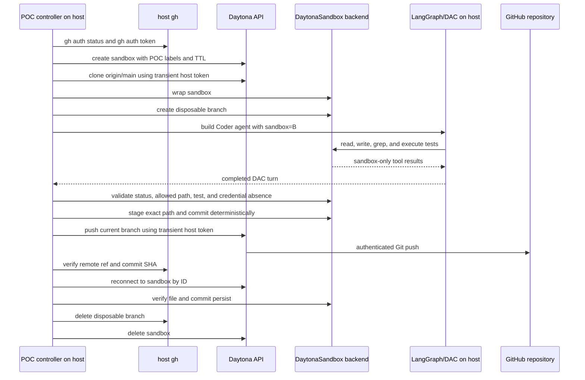

# Daytona Agent Backend Proof of Concept

**Date:** 2026-07-11  
**Status:** proposed for implementation  
**Scope:** a disposable live experiment that proves Clipse can keep LangGraph/DAC on the dispatcher host while routing agent filesystem and shell tools through an issue-scoped Daytona sandbox

## Goal

Prove Option A before changing Clipse's production worker lifecycle:

- LangGraph, DAC, model credentials, checkpoints, transcripts, and `gh` authentication remain on the trusted host.
- DAC's filesystem and shell tools operate only inside Daytona through `SandboxBackendProtocol`.
- Deterministic controller code validates and commits the sandbox delta.
- Host-owned credentials push the commit through Daytona's Git API without entering the agent's tools, environment, files, prompts, or logs.
- A second backend instance reconnects to the same sandbox and observes the committed repository state.
- Cleanup removes the disposable GitHub branch and Daytona sandbox.

The POC answers whether this architecture works. It does not add Daytona to the dispatcher, SQLite schema, board state machine, TUI, or production configuration.

## Decisions already made

1. **Backend:** Daytona is the recommended production backend. Local execution remains an explicit trusted-mode option and never becomes an automatic fallback.
2. **Sandbox scope:** one persistent Coder sandbox per issue, reused across rework turns. Reviewer runs use separate clean, read-only sandboxes.
3. **Agent placement:** the LLM loop and LangGraph run on the host. Only filesystem, search, edit, and shell operations run in Daytona.
4. **GitHub authentication:** the dispatcher host reuses the operator's existing `gh` authentication. The sandbox never receives `GH_TOKEN`, the `gh` config directory, or the host's home directory.
5. **Git ownership:** DAC edits and tests. Deterministic graph/controller nodes validate, stage, commit, push, open the PR, and merge.
6. **POC target:** use the current Clipse GitHub repository and a uniquely named disposable branch. Delete the branch in `finally` unless the operator explicitly requests retention for debugging.

## Why this POC is representative

Clipse pins `deepagents-code==0.1.22`. Its `create_cli_agent` accepts a `SandboxBackendProtocol` and uses a supplied sandbox for filesystem tools and `execute`. `langchain-daytona` supplies `DaytonaSandbox`, which wraps a Daytona SDK sandbox. The POC exercises those exact seams rather than building mock remote tools.

The bundled DAC Daytona provider cannot reconnect to an existing Daytona sandbox by ID at this pin. Clipse therefore must own lifecycle lookup and pass a constructed `DaytonaSandbox` into DAC. The POC tests that ownership model directly.

## Proposed artifacts

The implementation will add only POC-scoped and backward-compatible surfaces:

- `agent/src/clipse_agent/poc/daytona_backend.py`
  - preflight, sandbox creation, clone, DAC invocation, validation, commit, push, reattach, and cleanup
  - injectable Daytona, GitHub, model, and clock/ID seams for deterministic tests
- `agent/src/clipse_agent/poc/__init__.py`
- `agent/tests/test_daytona_backend_poc.py`
  - no network, Daytona, GitHub, or live model
- `agent/pyproject.toml` and `agent/uv.lock`
  - a `daytona` optional dependency using the pinned DAC package's Daytona extra
- `Makefile`
  - `poc-daytona` convenience target
- a small optional sandbox injection seam in `clipse_agent.dac.build_coder_agent`
  - `sandbox=None` and `sandbox_type=None` preserve all current production behavior

The POC will not modify the generated worker contract.

## Command and inputs

The operator runs:

```bash
DAYTONA_API_KEY=... CLIPSE_POC_MODEL=anthropic:claude-sonnet-4-6 make poc-daytona
```

The command uses the current repository's `origin` remote and configured default branch. Optional flags may select a different repository or preserve resources for debugging, but safe cleanup remains the default.

Required preflight checks:

1. `DAYTONA_API_KEY` is present.
2. `gh auth status` succeeds for `github.com`.
3. `gh auth token` returns a nonempty token to the controller process.
4. The repository remote resolves to a supported `github.com/<owner>/<repo>` URL.
5. The selected model can initialize on the host.
6. The disposable branch does not already exist.

Preflight completes before creating a sandbox or branch. Error messages identify the missing setup step without printing credentials.

## Live workflow



## Agent task

The live task is deliberately narrow. The agent must:

1. Create one file under `daytona-poc/<run-id>.txt` containing a controller-provided nonce.
2. Read the file back.
3. Run a shell assertion that checks the exact contents.
4. Report completion.

The agent must not commit or push. Deterministic controller code performs those operations after validation.

The branch is disposable, so an unexpected agent edit cannot reach `main`. The controller still rejects every changed path except the expected POC file.

## Credential boundary

The controller obtains the GitHub token from host-side `gh`. It may pass the token only as an argument to Daytona SDK Git clone/push methods. It must never:

- put the token in sandbox environment variables;
- interpolate the token into a shell command or remote URL;
- write it to `.git/config`, a credential helper, a setup script, or a file;
- include it in the model prompt, LangGraph state, transcript, logs, exceptions, or command output;
- pass host `HOME`, `.config/gh`, `GH_TOKEN`, or `GITHUB_TOKEN` to the sandbox.

Before commit, the controller checks:

- the sandbox environment contains no GitHub-token variable;
- `.git/config` contains no embedded credential;
- no Git credential helper or credential-store file was configured by the POC;
- agent output and captured command output do not contain the token or a meaningful token prefix.

These checks provide evidence for the intended boundary. They do not claim that Daytona's internal service never handles the transient token; Daytona must receive it to authenticate the Git operation.

## Deterministic validation and commit

After DAC returns, the controller uses the sandbox backend—not the host shell—to:

1. run `git status --porcelain`;
2. require exactly `daytona-poc/<run-id>.txt` as the changed path;
3. verify the file contains the exact nonce and no extra content;
4. rerun the shell assertion independently of the agent's report;
5. configure repository-local POC author identity;
6. stage the exact path, never `git add -A`;
7. commit with `test(poc): verify daytona agent backend`;
8. capture the commit SHA.

The controller then calls Daytona's Git API to push the current disposable branch with the transient host token. Host-side `gh` verifies that the remote branch points to the captured SHA.

## Persistence proof

The controller records the sandbox ID, releases the first `DaytonaSandbox` wrapper, fetches the same Daytona sandbox again, and creates a new wrapper. The second wrapper must observe:

- the same repository path;
- a clean working tree;
- the disposable branch;
- the committed POC file and nonce;
- the same commit SHA.

This proves the lifecycle shape required for Coder rework. It does not yet connect sandbox identity to SQLite issue records.

## Host-isolation proof

Before the live run, the controller creates a nonce-bearing sentinel in a host temporary directory outside the repository. The agent never receives that path. After the run, the controller verifies that the sentinel still exists with identical metadata and content.

The stronger proof is architectural: all DAC file and shell tools receive `DaytonaSandbox`, and the POC passes no `FilesystemBackend`, `LocalShellBackend`, or host `cwd` into the agent. Tests assert this construction.

## Cleanup and failure handling

Cleanup runs from `finally` and treats the sandbox and remote branch as independent resources:

1. Delete the remote branch if the POC created it.
2. Delete the Daytona sandbox if the POC created it.
3. Remove the host sentinel.
4. Report cleanup failures separately from the primary POC result.

The Daytona sandbox also receives identifying labels and an automatic deletion interval. These guard against process death before `finally` completes.

An explicit `--keep-on-failure` flag may retain the sandbox and branch. The command prints their non-secret identifiers and a cleanup command. The default remains destructive cleanup.

## Result format

The command prints a concise human summary and writes a JSON result under `.clipse/poc/`. The JSON contains:

- run ID;
- repository and disposable branch;
- sandbox ID;
- model spec;
- remote workspace path;
- agent tool operations observed;
- validation results;
- local and remote commit SHAs;
- reattachment result;
- cleanup status;
- total duration.

It excludes tokens, environment dumps, prompts containing secrets, and full provider exceptions that might embed request headers.

## Automated tests

Unit tests use fake Daytona, sandbox backend, GitHub, and agent-driver implementations. They cover:

- preflight fails before resource creation;
- the model receives a sandbox backend and never a local backend;
- the expected file/test path succeeds;
- extra changed paths abort before commit and push;
- failed independent validation aborts before commit and push;
- stage uses the exact expected path;
- clone and push receive the host token through the SDK seam only;
- logs/results redact the token;
- the second wrapper observes persistent state;
- branch cleanup and sandbox cleanup both run after success;
- each cleanup still runs when the other fails;
- `--keep-on-failure` retains resources and prints explicit cleanup instructions;
- existing local Coder behavior remains unchanged when `sandbox=None`.

The normal `make test` and `make lint` gates remain network-free.

## Live acceptance criteria

The POC passes only when all conditions hold:

1. A real DAC turn performs file and shell operations through Daytona.
2. The expected file and independent test succeed inside the sandbox.
3. No unexpected path changes.
4. No GitHub credential appears in the sandbox environment, repository config, agent output, transcript, or result artifact.
5. Deterministic code creates the commit.
6. Daytona pushes the disposable branch using host-owned `gh` authentication.
7. Host-side `gh` verifies the remote SHA.
8. A new backend wrapper reconnects to the same sandbox state.
9. The host sentinel remains unchanged.
10. Default cleanup removes both remote branch and sandbox.
11. `make test` and `make lint` pass afterward.

Any failed condition makes the experiment fail. A successful model message alone never counts as proof.

## Explicit non-goals

- No dispatcher `Spawner` integration.
- No production `worker.backend` configuration.
- No SQLite sandbox record or migration.
- No Coder/reviewer graph lifecycle changes beyond an optional backend injection seam.
- No PR creation, review comment, merge, Linear transition, or board outbox write.
- No Reviewer sandbox implementation.
- No snapshot optimization or package-cache design.
- No automatic local fallback.
- No GitHub App.

## Follow-up if the POC passes

A separate production design will cover:

- the kernel-owned sandbox manager and SQLite identity records;
- issue-scoped Coder reuse and per-run Reviewer isolation;
- Daytona snapshots and repository bootstrap;
- deterministic remote validation/commit/push nodes;
- cleanup on merge, cancellation, block, timeout, and orphan recovery;
- operator status/TUI surfaces;
- configuration, preflight, and explicit local trusted mode;
- domain/network policy and secret handling;
- migration and rollout strategy.

The production design must use the POC evidence instead of assuming provider behavior.
