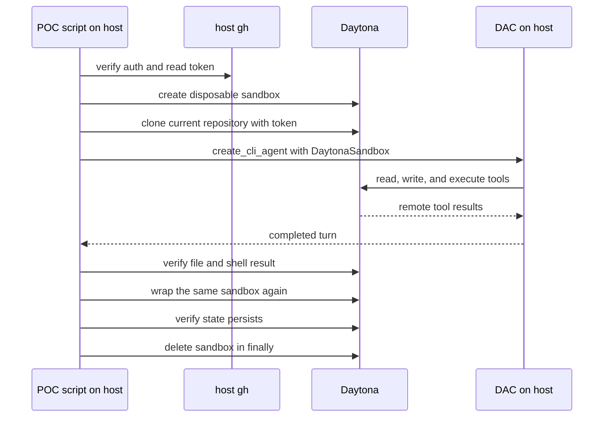

# Daytona Agent Backend Proof of Concept

**Date:** 2026-07-11  
**Status:** proposed for implementation

## Goal

Run one real DAC turn with its LLM and LangGraph on the host while every filesystem and shell tool operates inside Daytona. Prove the sandbox can be reattached and that host `gh` credentials can clone the repository without entering the agent environment.

This is a feasibility spike, not production integration.

## Questions the POC must answer

1. Can Clipse's pinned `deepagents-code==0.1.22` use `DaytonaSandbox` for its built-in file and shell tools?
2. Does the LLM remain on the host while tool calls execute in Daytona?
3. Can a new backend wrapper reconnect to the same sandbox and observe prior filesystem state?
4. Can the host authenticate a Daytona Git clone with `gh auth token` without exposing that token to DAC?

Authenticated Git push is a separate follow-up spike. This POC performs no remote write.

## Artifact

Add one standalone script:

```text
scripts/poc/daytona_agent_backend.py
```

Run it with runtime-only dependencies:

```bash
uv run --with "deepagents-code[daytona]==0.1.22" \
  python scripts/poc/daytona_agent_backend.py
```

The script requires `DAYTONA_API_KEY`, a working `gh auth status`, and host model authentication. `CLIPSE_POC_MODEL` selects the model and defaults to Clipse's Coder model.

The POC does not change `pyproject.toml`, `uv.lock`, the Makefile, production agent code, the dispatcher, SQLite, schemas, or configuration.

## Workflow



## Live task

The script generates a random nonce and asks DAC to:

1. create `/home/daytona/workspace/clipse/daytona-poc.txt` containing only that nonce;
2. read the file;
3. run a shell command that verifies the exact contents;
4. stop.

The script independently reads the file through `DaytonaSandbox` and runs the same assertion. The model's success message is not proof.

## Repository clone and credential boundary

The host obtains the current `origin` repository, normalizes it to `https://github.com/<owner>/<repo>.git`, and reads `gh auth token`. It passes the token only to Daytona's SDK clone method and clones into `/home/daytona/workspace/clipse`. The script never places the token in:

- the sandbox environment;
- a shell command or Git remote URL;
- `.git/config` or a credential helper;
- the prompt, model state, transcript, or output.

After the agent runs, the script checks that:

- `GH_TOKEN` and `GITHUB_TOKEN` are absent from the sandbox environment;
- `.git/config` does not contain the token;
- agent output does not contain the token.

The repository remains unchanged. The POC creates only an untracked file inside the disposable sandbox and deletes the sandbox afterward.

## Persistence check

After the first verification, the script records the sandbox ID and creates a second `DaytonaSandbox` wrapper around the same Daytona sandbox. The second wrapper must read the same nonce and execute the same shell assertion.

This proves the mechanism required for one Coder sandbox per issue. It does not implement issue-to-sandbox persistence in Clipse.

## Cleanup

The script deletes the sandbox in `finally`, whether the agent succeeds or fails. It prints the sandbox ID before the live turn so an operator can delete it manually if the process is killed.

No branch, commit, push, pull request, Linear write, or board transition occurs.

## Pass criteria

The POC passes only when:

1. the agent's file and shell tools operate through `DaytonaSandbox`;
2. the expected nonce file exists only in Daytona;
3. the independent shell assertion succeeds;
4. a second backend wrapper observes the same state;
5. GitHub credentials are absent from the sandbox environment, Git config, and agent output;
6. the sandbox is deleted after the run.

The script prints one concise PASS or FAIL summary. It must not print secrets.

## Deliberately excluded

- unit-test fakes and production-quality error taxonomy;
- dispatcher or Coder graph integration;
- deterministic commit and authenticated push;
- dependency or lockfile changes;
- Makefile targets and result artifacts;
- TTL, orphan recovery, snapshots, and status/TUI integration;
- Reviewer sandboxes and local-backend configuration.

If this spike passes, the next small experiment will create, push, verify, and delete a disposable GitHub branch using host-owned `gh` authentication.
